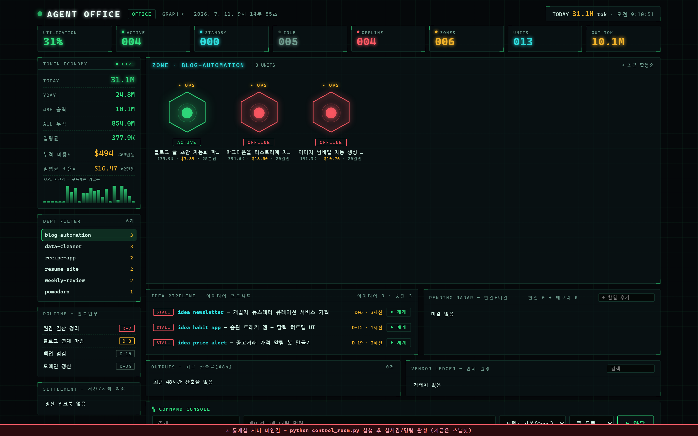
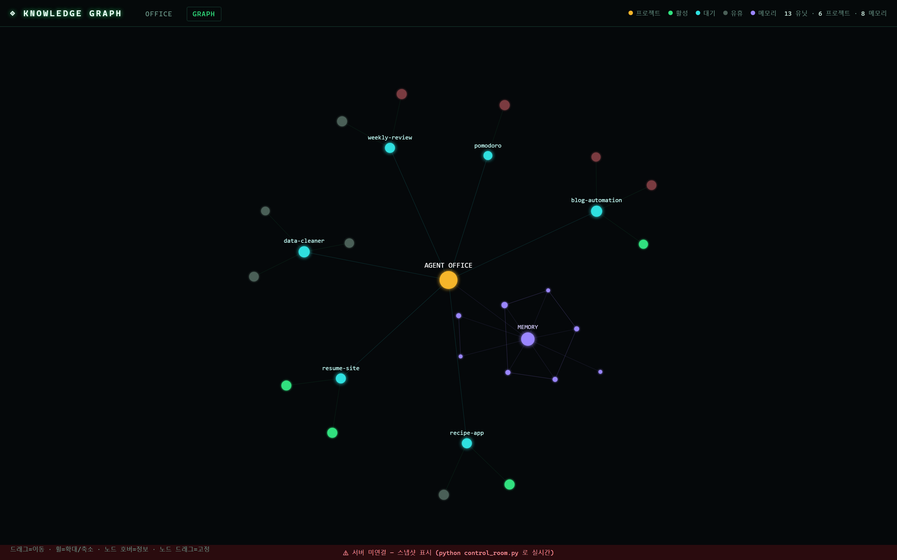

# Agent Office — Claude Code 에이전트 중앙 통제실

Claude Code로 작업한 **모든 세션을 "에이전트"로 시각화**하는 로컬 대시보드입니다.
J.A.R.V.I.S 스타일 관제실에서 현황을 감시하고, 에이전트에게 명령을 내릴 수 있습니다.





## 뭐가 보이나요?

- **AGENT OFFICE (HUD)** — 세션별 육각 노드: 활성/대기/유휴/오프라인 상태, 주제, 모델, 토큰
- **TOKEN ECONOMY** — 시간당/일평균/누적 토큰 + **API 환산 비용($/₩)**
- **KNOWLEDGE GRAPH** — 프로젝트·세션·메모리(`memory/*.md`)를 연결한 지식 그래프 (확대하면 상세)
- **IDEA PIPELINE** — 방치된 아이디어 프로젝트 자동 감지 + ▶재개 버튼
- **COMMAND CONSOLE** — 노드 클릭(⌖)으로 특정 세션을 이어받아 명령, 모델(Opus/Sonnet/Haiku) 선택

## 요구사항

- Windows + Python 3.10+ (표준 라이브러리만 사용, 추가 설치 없음)
- [Claude Code](https://claude.com/claude-code) 사용 이력 (`~/.claude/projects/`에 세션 로그가 있어야 함)

## 시작하기

1. 이 폴더를 아무 곳에나 두고 **`start.bat` 더블클릭**
2. 브라우저에서 http://127.0.0.1:8787 이 열립니다 (첫 집계 10~30초)
3. 로그온 시 자동 시작을 원하면 `autostart_install.bat` 한 번 실행

서버 없이 보기만 하려면: `python _inject.py` 실행 후 `dashboard.html` 더블클릭
(데이터 스냅샷이 파일에 내장됩니다)

## 명령 하달 (선택)

기본 모드에서 명령은 **큐에 저장만** 됩니다. 실제로 headless Claude 에이전트를
실행하려면 서버를 `--allow-launch` 로 켜세요:

```
python control_room.py --allow-launch
```

- 육각 노드 클릭 → ⌖ 대상 지정 → 명령 입력 → 그 세션의 기억을 이어받아 실행 (`claude --resume`)
- 모델 선택: Opus 4.8 / Sonnet 5 / Haiku 4.5
- 실행 상태(queued→running→done)와 결과가 명령 이력에 표시됩니다

⚠️ `--allow-launch`는 로컬 HTTP로 에이전트를 실행하는 기능입니다. 서버는 127.0.0.1에만
바인딩되지만, 신뢰하는 로컬 환경에서만 켜세요.

## 설정 (config.json — 선택)

`config.example.json`을 `config.json`으로 복사해 수정:

```json
{
  "idea_prefix": "Money",        // 이 접두사의 프로젝트 = 아이디어 파이프라인 대상
  "usd_krw": 1400,               // 비용 원화 환산 환율
  "recur": [                     // 반복업무 D-day (제목, 기준일(1~31 또는 "EOM"), 주기개월)
    ["월간 보고서", 5, 1],
    ["분기 점검", "EOM", 3]
  ]
}
```

## 확장 포인트

`aggregate.py`의 `office` 섹션이 대시보드 하단 패널들의 데이터원입니다.
자기 업무 데이터(할일 엑셀, 문서 폴더, 정산 파일 등)를 붙이고 싶다면
`tasks / pending / outputs / vendors / settle` 리스트를 채우는 함수를 추가하세요 —
UI는 이미 렌더링을 지원합니다.

## 비용 표시에 대해

표시되는 금액은 **Claude API 공식 단가 기준 환산치**입니다
(Opus $5/$25 · Sonnet $3/$15 · Haiku $1/$5 per MTok, 캐시 읽기 0.1× / 쓰기 1.25×).
구독제(Pro/Max) 사용자라면 실제 지출이 아니라 "구독으로 뽑아낸 가치"로 해석하세요.

## 개인정보

이 도구는 **전부 로컬에서만** 동작합니다. 어떤 데이터도 외부로 전송하지 않습니다.
읽는 것: `~/.claude/projects/`의 세션 로그(로컬), 쓰는 것: 이 폴더의 json/log 파일.

## 라이선스

MIT
